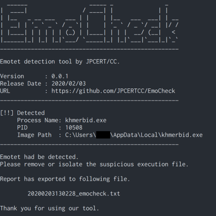

# EmoCheck

[](https://github.com/jpcertcc/emocheck/releases)
[](http://www.somsubhra.com/github-release-stats/?username=jpcertcc&repository=emocheck)

Emotet detection tool for Windows OS.

## How to use

1. Download EmoCheck from the Releases page.
2. Run EmoCheck on the host.
3. Check the exported report.

## Download

Please download from the [Releases](https://github.com/JPCERTCC/EmoCheck/releases) page.

Latest hash:  

> emocheck_v2.0_x86.exe  
>   MD5   : a623ec55128763ef3ee95c1ce18424dc  
>   SHA256: 369595afdb67bd54b4d0b5010cece75d80d660d7c7caaa49fdffa2e27f0274a0

> emocheck_v2.0_x64.exe  
>   MD5   : 25bb801e219f82bad6f53d94edfc0ff6  
>   SHA256: e830d6b7f3b82747fc565d6eb7c12cf8b82454f1f735bde3e73d6f73a5819462

## Command options

(since v0.0.2)  

- Specify output directory for the report (default: current directory)
  - `/output [your output directory]` or `-output [your output directory]`
- No console output
  - `/quiet` or `-quiet`
- Export the report in JSON style
  - `/json` or `-json`
- Debug mode (no report)
  - `/debug` or `-debug`
- Show help
  - `/help` or `-help`

## How EmoCheck detects Emotet

(v0.0.1)  
Emotet generates their process name from a specific word dictionary and C drive serial number.
EmoCheck scans the running process on the host, and find Emotet process from their process name.

(added in v0.0.2)  
Emotet keeps their encoded process name in a specific registry key.
EmoCheck looks up and decode the registry value, and find it from the process list.
Code Signing with Microsoft Authenticode.

(added in v1.0)  
Support the April 2020 updated of Emotet.  
Obfuscated code.  

(added in v2.0)  
Support the December 2020 updated of Emotet.  
French language support. (Thanks to CERT-FR)

## Sample Report

Text stlye:  

```txt
[Emocheck v0.0.2]
Scan time: 2020-02-10 13:06:20
____________________________________________________

[Result]
Detected Emotet process.

[Emotet Process]
     Process Name  : mstask.exe
     Process ID    : 716
     Image Path    : C:\Users\[username]\AppData\Local\mstask.exe
____________________________________________________

Please remove or isolate the suspicious execution file.
```

JSON style (added in v0.0.2):  

```json
{
  "scan_time":"2020-02-10 13:06:20",
  "hostname":"[your hostname]",
  "emocheck_version":"0.0.2",
  "is_infected":"yes",
  "emotet_processes":[
    {
       "process_name":"mstask.exe",
       "process_id":"716",
       "image_path":"C:\\Users\\[username]\\AppData\\Local\\mstask.exe"
    }
  ]
}
```

The report will be exported to the following path.

(v0.0.1)  
`[current directory]\yyyymmddhhmmss_emocheck.txt`

(since v0.0.2)  
`[output path]\[computer name]_yyyymmddhhmmss_emocheck.txt`  
`[output path]\[computer name]_yyyymmddhhmmss_emocheck.json`

## Screenshot

(v0.0.1)  
<div align="left"></div>

## Releases

- (Feb. 3, 2020) v0.0.1
  - Initial release
- (Feb. 10, 2020) v0.0.2
  - update detecting method
  - add options
- (Aug. 11, 2020) v1.0.0
  - update detecting method
- (Jan. 27, 2021) v2.0.0
  - update detecting method
  - Added French language support

## Notes

### Tested environments

- Windows 10 1809 64bit Japanese Edition
- Windows 8.1 64bit Japanese Edition
- ~~Windows 7 SP1 32bit Japanese Edition~~
- ~~Windows 7 SP1 64bit Japanese Edition~~

Windows 7 does not support UTF-8 output in the Command Prompt.


### Build

- Windows 10 1809 64bit Japanese Edition
- Microsoft Visual Studio Community 2017

### Source code

Not published from v1.0.
