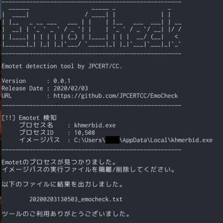

# EmoCheck

[](https://github.com/jpcertcc/emocheck/releases)
[](http://www.somsubhra.com/github-release-stats/?username=jpcertcc&repository=emocheck)

Windows OS 用 Emotet 検知ツール

## 使用方法

1. Releases からツールをダウンロード
2. 感染が疑われるホストでツールを実行
3. 出力されるレポートを確認

## ダウンロード

以下のページからダウンロードできます。

 [Releases](https://github.com/JPCERTCC/EmoCheck/releases)

なお、ファイルのハッシュ値は以下の通りです。

> emocheck_v1.0_x86.exe
>   MD5   : 00f7612ff7e571115638206dd5b32f2c
>   SHA256: 544b6eb3bc04e9015ae7b4078e20a33a28c35370fb9e2c498d65e072c4c81bf3

> emocheck_v1.0_x64.exe
>   MD5   : 59ecb58b11c6df9324043fe4d2caf210
>   SHA256: cb80892758754d12af2148bcffc32eae0daa02c4815415b394aff2d79e0b761b

## コマンドオプション

(v0.0.2 追加)  

- レポート出力先ディレクトリ指定 (デフォルト: カレントディレクトリ)
  - `/output [出力先ディレクトリ]` または `-output [出力先ディレクトリ]`
- コマンドライン出力抑止
  - `/quiet` または `-quiet`
- JSON形式でのレポート出力
  - `/json` または `-json`
- 詳細表示（レポート出力なし）
  - `/debug` または `-debug`
- ヘルプ表示
  - `/help` または `-help`

## Emotetの検知方法

EmoCheck はホスト上のプロセス一覧から Emotet のプロセスを検知します。

## レポート例

Emotetが検知された場合、以下のようなレポートが作成されます。  

テキスト形式:  

```txt
[Emocheck v0.0.2]
プログラム実行時刻: 2020-02-10 10:45:51
____________________________________________________

[結果]
Emotetを検知しました

[詳細]
     プロセス名    : mstask.exe
     プロセスID    : 716
     イメージパス  : C:\Users\[ユーザー名]\AppData\Local\mstask.exe
____________________________________________________

不審なイメージパスの実行ファイルを隔離/削除してください。
```

JSON形式 (v0.0.2 追加):  

```json
{
  "scan_time":"2020-02-10 10:45:51",
  "hostname":"[ホスト名]",
  "emocheck_version":"0.0.2",
  "is_infected":"yes",
  "emotet_processes":[
    {
       "process_name":"mstask.exe",
       "process_id":"716",
       "image_path":"C:\\Users\\[ユーザー名]\\AppData\\Local\\mstask.exe"
    }
  ]
}
```

レポートは以下のパスに生成されます。

(v0.0.1)  
`[カレントディレクトリ]\yyyymmddhhmmss_emocheck.txt`

(v0.0.2 以降)  
`[指定ディレクトリ]\[ホスト名]_yyyymmddhhmmss_emocheck.txt`  
`[指定ディレクトリ]\[ホスト名]_yyyymmddhhmmss_emocheck.json`

Emotetが検知された場合、以下のようなレポートが作成されます。

## スクリーンショット

(v0.0.1)  
<div align="left"></div>

## 更新履歴

- (2020/02/03) v0.0.1
- (2020/02/10) v0.0.2
  - 検知手法の追加
  - コマンドオプションの追加
- (2020/08/11) v1.0.0
  - 検知手法の追加

## その他

### 動作確認環境

- Windows 10 1809 64bit 日本語版
- Windows 8.1 64bit 日本語版
- Windows 7 SP1 32bit 日本語版
- Windows 7 SP1 64bit 日本語版

### ビルド環境

- Windows 10 1809 64bit 日本語版
- Microsoft Visual Studio Community 2017

### ソースコード

v1.0は公開していません。
